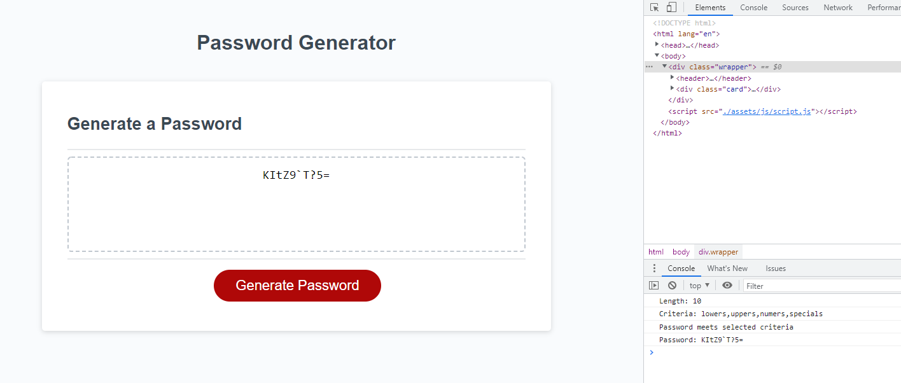

# Password-Generator
A homework challenge to create a password generator by applying our knowledge from the week's JavaScript lesson

## Website
https://eclevela-1234.github.io/Password-Generator/

## Notes
* For this assignment, we were given base code with HTML/CSS and event listeners
* Functions were first strategized on paper then brought to life through trial and error
* The steps are original to me
* I did have to look up the every function using source referenced [here!](https://bobbyhadz.com/blog/javascript-check-if-array-contains-all-elements-another-array)

## Concepts Learned
* Scoping, Hoisting, JS Math methods, callbacks, arrays/objects

## Final Thoughts

I had an advantage, having already taken the Data Analytics Boot Camp. While that program was mostly Python-based, I already understood the core concepts of functions. I really enjoyed this assignment. Even though it was relatively simple, it forced me to understand a lot of foundational principles for working with JS. I am looking forward to reviewing this one day and realizing it could have been accomplished with 10% of the amount of code. Wanted to continue refactoring but needed to move on.
